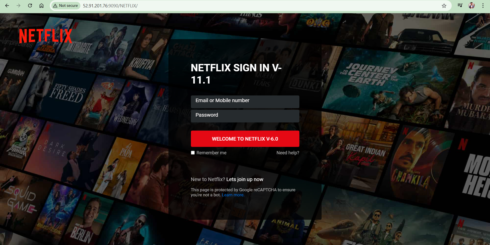
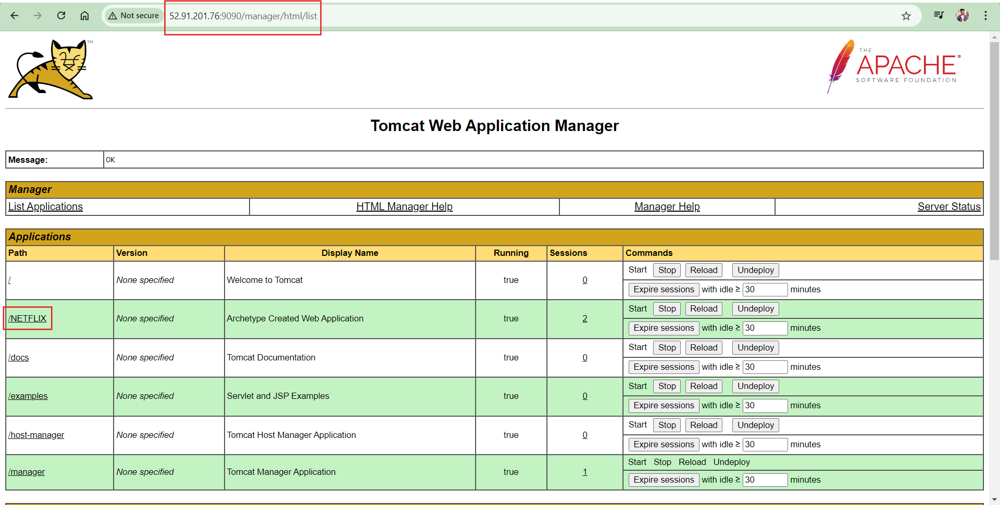

 
**Project: Automating Deployment of a Netflix-like Application with Jenkins Pipeline**

Project Overview
The aim of this project is to automate the deployment process of a Netflix-like application using Jenkins. This automation streamlines continuous integration and delivery, enabling frequent and reliable application updates. The project utilizes Java and CSS for development and deploys the application on an EC2 server using a Tomcat server.
Table of Contents
•	Project Overview
•	Prerequisites
•	Setup Instructions
•	Jenkins Pipeline Configuration
•	Deploying to Tomcat Server

**Prerequisites**
•	Java Development Kit (JDK)
•	Apache Maven
•	Tomcat Server
•	Amazon EC2 Instance
•	Jenkins Server
•	GitHub Repository
•	Docker (optional, for containerization)

**Setup Instructions**

1.Clone the Repository:

git clone https://github.com/Om-devops/Netflix-prj.git

cd Netflix-prj

2.Build the Application:

mvn clean package
1.	Start Tomcat Server:
o	Ensure Tomcat is running on your EC2 instance.
o	Deploy the WAR file to Tomcat.

**Jenkins Pipeline Configuration**

1.	Install Jenkins:
o	Set up Jenkins on your EC2 instance or any server of your choice.
o	Install necessary plugins (Git, Maven Integration, Deploy to Container, etc.).
2.	Create a Jenkins Pipeline Job:
o	Open Jenkins Dashboard.
o	Create a new item and select "Pipeline".
o	Configure your pipeline with the following script:

pipeline {
    agent any

    environment {
        EC2_IP = '52.91.201.76'
        TOMCAT_USER = 'admin'
        TOMCAT_PASS = 'admin'
        WAR_FILE = 'NETFLIX-1.2.2.war'
        APP_PATH = '/yourapp'
    }

    stages {
        stage('Checkout') {
            steps {
                git 'https://github.com/Om-devops/Netflix-prj.git'
            }
        }

        stage('Build') {
            steps {
                sh 'mvn clean package'
            }
        }

        stage('Deploy to Tomcat') {
            steps {
                script {
                    def tomcatUrl = "http://${env.EC2_IP}:9090/manager/text/deploy?path=${env.APP_PATH}&update=true"
                    sh """
                    curl --upload-file target/${env.WAR_FILE} \
                         --user ${env.TOMCAT_USER}:${env.TOMCAT_PASS} \
                         ${tomcatUrl}
                    """
                }
            }
        }
    }
}

**Deploying to Tomcat Server**
1.	Deploy Using Jenkins:
o	Trigger the Jenkins job to build and deploy the application.
2.	Manual Deployment (if needed):
o	Copy the WAR file to the Tomcat webapps directory.
 

 

